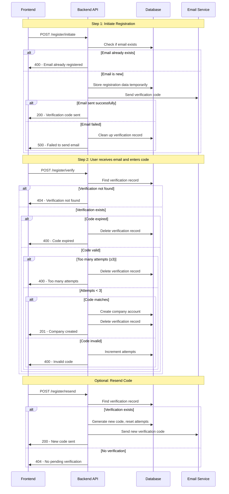

# Company Registration API Documentation

## Overview

The company registration system implements a secure two-step verification process using email verification. This ensures that only valid email addresses are used for company accounts and prevents unauthorized registrations.

## Architecture

The registration system consists of:
- **Two-step registration flow** with email verification
- **Temporary data storage** for pending registrations (10-minute expiry)
- **Rate limiting** with attempt tracking (max 3 attempts)
- **Email service integration** using Loops API
- **Automatic cleanup** of expired/failed verification records

## API Endpoints

### Base URL
```
/api/v1/register
```

---


## 2. Initiate Registration

### `POST /initiate`

Start the registration process by sending a verification code to the company's email.

#### Request Body

```json
{
  "email": "company@example.com",
  "password": "securepassword123",
  "name": "Padel Club Barcelona",
  "address": "Carrer de la Marina, 123, Barcelona",
  "phone_number": "+34 123 456 789"
}
```

#### Request Schema

| Field | Type | Required | Description |
|-------|------|----------|-------------|
| `email` | string (email) | ✅ | Company email address |
| `password` | string | ✅ | Company password (will be hashed) |
| `name` | string | ✅ | Company/Club name |
| `address` | string | ✅ | Company address |
| `phone_number` | string | ✅ | Company phone number |

#### Success Response (200)

```json
{
  "message": "Verification code sent to your email",
  "email": "company@example.com",
  "expires_in_minutes": 10
}
```

#### Error Responses

**Email Already Registered (400):**
```json
{
  "detail": "Email already registered"
}
```

**Email Service Not Configured (503):**
```json
{
  "detail": "Email service is not configured. Please contact support."
}
```

**Email Send Failed (500):**
```json
{
  "detail": "Failed to send verification email. Please try again."
}
```

---

## 3. Verify Email and Complete Registration

### `POST /verify`

Complete the registration by verifying the email code and creating the company account.

#### Request Body

```json
{
  "email": "company@example.com",
  "code": "123456"
}
```

#### Request Schema

| Field | Type | Required | Description |
|-------|------|----------|-------------|
| `email` | string (email) | ✅ | Company email address |
| `code` | string | ✅ | 6-digit verification code |

#### Success Response (201)

```json
{
  "id": 1,
  "email": "company@example.com",
  "name": "Padel Club Barcelona",
  "address": "Carrer de la Marina, 123, Barcelona",
  "phone_number": "+34 123 456 789",
  "login": "12345678",
  "created_at": "2024-01-15T10:30:00Z",
  "updated_at": "2024-01-15T10:30:00Z"
}
```

#### Error Responses

**Verification Not Found (404):**
```json
{
  "detail": "Verification record not found. Please start registration again."
}
```

**Code Expired (400):**
```json
{
  "detail": "Verification code expired. Please start registration again."
}
```

**Invalid Code (400):**
```json
{
  "detail": "Invalid verification code. 2 attempts remaining."
}
```

**Too Many Attempts (400):**
```json
{
  "detail": "Too many failed attempts. Please start registration again."
}
```

**Email Already Registered (400):**
```json
{
  "detail": "Email already registered"
}
```

---

## 4. Resend Verification Code

### `POST /resend`

Resend a new verification code to the email address.

#### Request Body

```json
{
  "email": "company@example.com"
}
```

#### Request Schema

| Field | Type | Required | Description |
|-------|------|----------|-------------|
| `email` | string (email) | ✅ | Company email address |

#### Success Response (200)

```json
{
  "message": "New verification code sent",
  "expires_in_minutes": 10
}
```

#### Error Responses

**No Pending Verification (404):**
```json
{
  "detail": "No pending verification for this email"
}
```

**Email Service Not Configured (503):**
```json
{
  "detail": "Email service is not configured. Please contact support."
}
```

**Email Send Failed (500):**
```json
{
  "detail": "Failed to send verification email. Please try again."
}
```

---

## Registration Flow



---

## Frontend Integration Guide

### 1. Registration Form Component

```typescript
interface RegistrationFormData {
  email: string;
  password: string;
  name: string;
  address: string;
  phone_number: string;
}

interface RegistrationStepProps {
  onSuccess: (response: any) => void;
  onError: (error: string) => void;
}
```

### 2. Step 1: Initial Registration

```typescript
const handleInitialRegistration = async (formData: RegistrationFormData) => {
  try {
    const response = await fetch('/api/v1/register/initiate', {
      method: 'POST',
      headers: {
        'Content-Type': 'application/json',
      },
      body: JSON.stringify(formData),
    });

    if (!response.ok) {
      const error = await response.json();
      throw new Error(error.detail || 'Registration failed');
    }

    const data = await response.json();
    // Show verification step
    setShowVerificationStep(true);
    setUserEmail(formData.email);
    setExpirationTime(Date.now() + (data.expires_in_minutes * 60 * 1000));
    
  } catch (error) {
    // Handle error (show error message to user)
    console.error('Registration initiation failed:', error.message);
  }
};
```

### 3. Step 2: Email Verification

```typescript
const handleEmailVerification = async (email: string, code: string) => {
  try {
    const response = await fetch('/api/v1/register/verify', {
      method: 'POST',
      headers: {
        'Content-Type': 'application/json',
      },
      body: JSON.stringify({ email, code }),
    });

    if (!response.ok) {
      const error = await response.json();
      throw new Error(error.detail || 'Verification failed');
    }

    const companyData = await response.json();
    // Registration successful - redirect to dashboard or login
    onRegistrationSuccess(companyData);
    
  } catch (error) {
    // Handle specific error cases
    if (error.message.includes('attempts remaining')) {
      // Show remaining attempts
      setErrorMessage(error.message);
    } else if (error.message.includes('expired')) {
      // Offer to restart registration
      setShowRestartOption(true);
    } else {
      setErrorMessage(error.message);
    }
  }
};
```

### 4. Resend Verification Code

```typescript
const handleResendCode = async (email: string) => {
  try {
    const response = await fetch('/api/v1/register/resend', {
      method: 'POST',
      headers: {
        'Content-Type': 'application/json',
      },
      body: JSON.stringify({ email }),
    });

    if (!response.ok) {
      const error = await response.json();
      throw new Error(error.detail || 'Resend failed');
    }

    const data = await response.json();
    // Update expiration time and show success message
    setExpirationTime(Date.now() + (10 * 60 * 1000));
    setSuccessMessage('New verification code sent to your email');
    
  } catch (error) {
    setErrorMessage(error.message);
  }
};
```

### 5. Email Service Status Check

```typescript
const checkEmailServiceStatus = async () => {
  try {
    const response = await fetch('/api/v1/register/test-loops');
    const data = await response.json();
    
    if (data.status !== 'success') {
      // Show warning that email service is not available
      setEmailServiceWarning(data.message);
      return false;
    }
    
    return true;
  } catch (error) {
    console.error('Email service check failed:', error);
    return false;
  }
};
```

---

## Security Features

### 1. Rate Limiting
- **Maximum 3 verification attempts** per registration
- **Automatic cleanup** after failed attempts
- **Reset attempts** when resending verification code

### 2. Time-based Expiration
- **10-minute expiration** for verification codes
- **Automatic cleanup** of expired records
- **Fresh expiration** when resending codes

### 3. Data Protection
- **Password hashing** before storage
- **Temporary data storage** for registration data
- **Automatic cleanup** after successful registration

### 4. Email Validation
- **Duplicate email prevention** across all endpoints
- **Email format validation** using Pydantic EmailStr
- **Race condition protection** during final registration

---

## Error Handling Best Practices

### 1. User-Friendly Messages
```typescript
const getErrorMessage = (error: string): string => {
  const errorMappings = {
    'Email already registered': 'This email is already registered. Please try logging in instead.',
    'Verification code expired': 'Your verification code has expired. Please request a new one.',
    'Too many failed attempts': 'Too many incorrect attempts. Please start the registration process again.',
    'Email service is not configured': 'Registration is temporarily unavailable. Please try again later.',
  };
  
  return errorMappings[error] || error;
};
```

### 2. Retry Logic
```typescript
const registerWithRetry = async (formData: RegistrationFormData, maxRetries = 3) => {
  for (let attempt = 1; attempt <= maxRetries; attempt++) {
    try {
      return await handleInitialRegistration(formData);
    } catch (error) {
      if (attempt === maxRetries || !isRetryableError(error)) {
        throw error;
      }
      // Wait before retry
      await new Promise(resolve => setTimeout(resolve, 1000 * attempt));
    }
  }
};

const isRetryableError = (error: Error): boolean => {
  return error.message.includes('Failed to send verification email') ||
         error.message.includes('service unavailable');
};
```

### 3. Progress Tracking
```typescript
enum RegistrationStep {
  FORM = 'form',
  EMAIL_SENT = 'email_sent',
  VERIFICATION = 'verification',
  COMPLETED = 'completed',
  ERROR = 'error'
}

const [currentStep, setCurrentStep] = useState(RegistrationStep.FORM);
```

---

## Testing Considerations

### 1. Email Service Testing
- Use the `/test-loops` endpoint before showing registration form
- Handle email service unavailability gracefully
- Show appropriate messages when email service is down

### 2. Code Expiration Testing
- Implement countdown timers for verification codes
- Handle expired codes gracefully
- Offer easy resend options

### 3. Network Error Handling
- Implement proper loading states
- Handle timeout errors
- Provide retry mechanisms

---

## Environment Variables Required

```bash
# Email service configuration
LOOPS_API_KEY=your_loops_api_key
LOOPS_VERIFICATION_TEMPLATE_ID=your_template_id
```

---

## Company Data Structure

After successful registration, the company object contains:

```typescript
interface Company {
  id: number;
  email: string;
  name: string;
  address: string;
  phone_number: string;
  login: string;          // 8-digit unique identifier
  created_at: string;     // ISO 8601 timestamp
  updated_at: string;     // ISO 8601 timestamp
}
```

---
