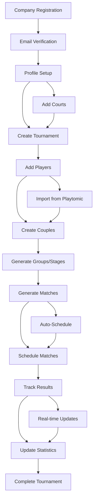
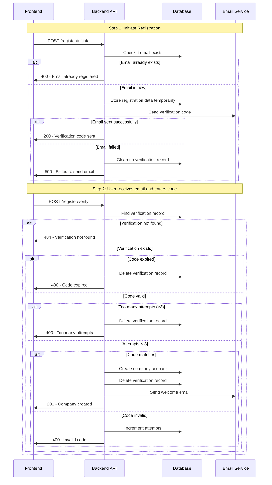
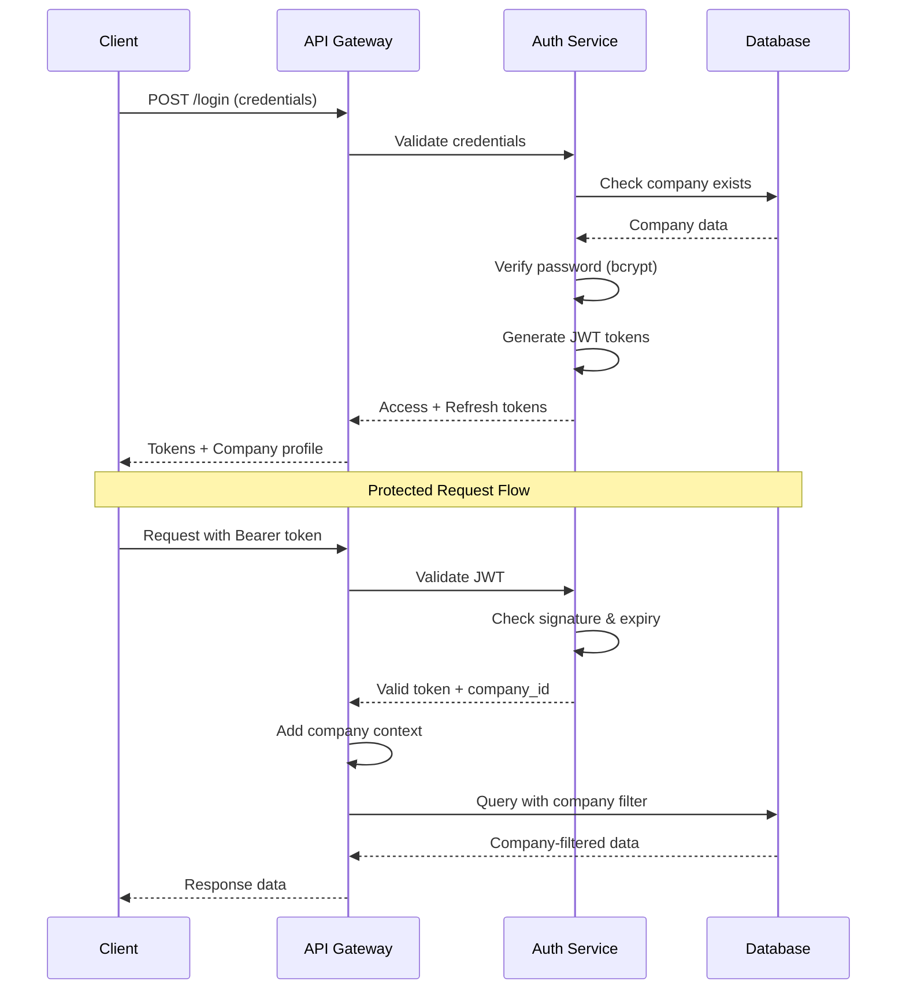
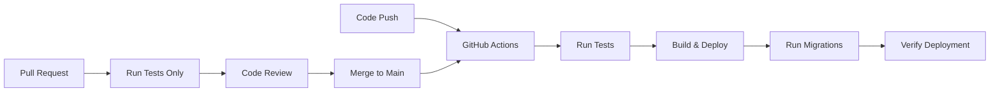

# 🏓 PadelTour API - Complete Documentation

## 📋 Table of Contents
- [Project Overview](#-project-overview)
- [Architecture](#️-architecture)
- [Tech Stack](#-tech-stack)
- [Data Models & Relationships](#️-data-models--relationships)
- [API Endpoints](#-api-endpoints)
- [Core System Flows](#-core-system-flows)
- [Company Registration System](#-company-registration-system)
- [Tournament Staging System](#-tournament-staging-system)
- [Services Architecture](#️-services-architecture)
- [Match Scheduling Algorithm](#-match-scheduling-algorithm)
- [Authentication & Security](#-authentication--security)
- [Real-time Statistics](#-real-time-statistics)
- [Error Handling & Recovery](#-error-handling--recovery)
- [Deployment Guide](#-deployment-guide)
- [Monitoring & Logging](#-monitoring--logging)
- [Environment Setup](#-environment-setup)

## 🏓 Project Overview

**PadelTour API** is a comprehensive FastAPI-based backend system for managing padel tournaments. It provides complete tournament lifecycle management from registration and player management to match scheduling and result tracking.

### Key Features
- 🏢 **Company Management**: Multi-tenant system with company registration and authentication
- 👥 **Player Management**: Player profiles with integration to Playtomic platform
- 🏆 **Tournament Management**: Complete tournament lifecycle with stages, groups, and brackets
- 📅 **Match Scheduling**: Advanced scheduling system with court availability and time management
- 📊 **Statistics Tracking**: Real-time couple statistics and tournament standings
- 🎾 **Court Integration**: Court management with availability tracking
- ✉️ **Email Services**: Automated notifications and verification emails
- 📈 **Monitoring**: Advanced logging and Grafana integration

## 🏗️ Architecture

### System Architecture Diagram

```
┌─────────────────────────────────────────────────────────────┐
│                    Client Applications                      │
│              (Web App, Mobile App, etc.)                   │
└─────────────────────┬───────────────────────────────────────┘
                      │ HTTP/HTTPS
                      ▼
┌─────────────────────────────────────────────────────────────┐
│                    FastAPI Gateway                         │
│                   (app/main.py)                           │
│  ┌─────────────────┐  ┌─────────────────┐  ┌─────────────┐ │
│  │  CORS Middleware │  │ Enhanced Logging │  │ Auth Guard  │ │
│  └─────────────────┘  └─────────────────┘  └─────────────┘ │
└─────────────────────┬───────────────────────────────────────┘
                      │
                      ▼
┌─────────────────────────────────────────────────────────────┐
│                   API Layer (v1)                          │
│  ┌──────────────┐ ┌──────────────┐ ┌──────────────┐      │
│  │ Auth         │ │ Tournaments  │ │ Players      │      │
│  │ Endpoints    │ │ Endpoints    │ │ Endpoints    │      │
│  └──────────────┘ └──────────────┘ └──────────────┘      │
│  ┌──────────────┐ ┌──────────────┐ ┌──────────────┐      │
│  │ Companies    │ │ Courts       │ │ Staging      │      │
│  │ Endpoints    │ │ Endpoints    │ │ Endpoints    │      │
│  └──────────────┘ └──────────────┘ └──────────────┘      │
└─────────────────────┬───────────────────────────────────────┘
                      │
                      ▼
┌─────────────────────────────────────────────────────────────┐
│                 Service Layer                              │
│  ┌─────────────────┐  ┌─────────────────┐  ┌─────────────┐ │
│  │ Tournament      │  │ Match Scheduling │  │ Player      │ │
│  │ Service         │  │ Service          │  │ Service     │ │
│  └─────────────────┘  └─────────────────┘  └─────────────┘ │
│  ┌─────────────────┐  ┌─────────────────┐  ┌─────────────┐ │
│  │ Company         │  │ Email           │  │ Storage     │ │
│  │ Service         │  │ Service         │  │ Service     │ │
│  └─────────────────┘  └─────────────────┘  └─────────────┘ │
└─────────────────────┬───────────────────────────────────────┘
                      │
                      ▼
┌─────────────────────────────────────────────────────────────┐
│                Repository Layer                            │
│  ┌─────────────────┐  ┌─────────────────┐  ┌─────────────┐ │
│  │ Tournament      │  │ Match           │  │ Couple Stats│ │
│  │ Repository      │  │ Repository      │  │ Repository  │ │
│  └─────────────────┘  └─────────────────┘  └─────────────┘ │
└─────────────────────┬───────────────────────────────────────┘
                      │
                      ▼
┌─────────────────────────────────────────────────────────────┐
│                   Data Layer                              │
│  ┌─────────────────┐  ┌─────────────────┐  ┌─────────────┐ │
│  │ PostgreSQL      │  │ Supabase        │  │ Alembic     │ │
│  │ Database        │  │ Storage         │  │ Migrations  │ │
│  └─────────────────┘  └─────────────────┘  └─────────────┘ │
└─────────────────────────────────────────────────────────────┘

External Integrations:
┌─────────────────┐  ┌─────────────────┐  ┌─────────────────┐
│ Playtomic API   │  │ Loops Email     │  │ Grafana         │
│ (Player Data)   │  │ Service         │  │ Monitoring      │
└─────────────────┘  └─────────────────┘  └─────────────────┘
```

## 💻 Tech Stack

### Backend
- **Framework**: FastAPI 0.111.0
- **Language**: Python 3.8+
- **Database**: PostgreSQL with SQLAlchemy 2.0.36
- **Authentication**: JWT tokens with bcrypt
- **Migrations**: Alembic
- **Validation**: Pydantic v2
- **ASGI Server**: Uvicorn

### External Services
- **Storage**: Supabase (file storage)
- **Email**: Loops Email Service
- **Player Data**: Playtomic API integration
- **Monitoring**: Grafana dashboards

### Development Tools
- **Testing**: pytest, pytest-asyncio
- **Code Quality**: Type hints with Pydantic
- **Container**: Docker & Docker Compose
- **Deployment**: Heroku (Procfile included)

## 🗄️ Data Models & Relationships

### Entity Relationship Diagram

```
Companies
├── id (PK)
├── email (unique)
├── name
├── login (8-digit code)
└── vat_number

Players                     Tournaments
├── id (PK)                ├── id (PK)
├── nickname              ├── name
├── email                 ├── company_id (FK)
├── playtomic_id          ├── start_date
├── level                 ├── end_date
└── gender                └── players_number

Tournament Stages           Tournament Groups
├── id (PK)                ├── id (PK)
├── tournament_id (FK)     ├── stage_id (FK)
├── name                   ├── name
├── stage_type             └── config
├── order
└── config

Tournament Couples          Matches
├── id (PK)                ├── id (PK)
├── tournament_id (FK)     ├── tournament_id (FK)
├── first_player_id (FK)   ├── couple1_id (FK)
├── second_player_id (FK)  ├── couple2_id (FK)
└── name                   ├── winner_couple_id (FK)
                          ├── stage_id (FK)
                          ├── group_id (FK)
                          ├── bracket_id (FK)
                          ├── court_id (FK)
                          ├── scheduled_start
                          └── games (JSONB)

Courts                      Couple Stats
├── id (PK)                ├── id (PK)
├── company_id (FK)        ├── tournament_id (FK)
├── name                   ├── couple_id (FK)
├── surface_type           ├── matches_played
└── location              ├── matches_won
                          ├── games_won
                          └── total_points
```

### Relationship Flows

```
Company (1) ──→ (N) Tournaments
Company (1) ──→ (N) Courts
Company (1) ──→ (N) Players (via PlayerCompany)

Tournament (1) ──→ (N) Tournament Stages
Tournament (1) ──→ (N) Tournament Couples
Tournament (1) ──→ (N) Matches

Stage (1) ──→ (N) Groups (for group stages)
Stage (1) ──→ (N) Brackets (for elimination stages)

Player (N) ──→ (N) Tournament Couples (as first or second player)
Court (1) ──→ (N) Matches (scheduling)
```

## 🔗 API Endpoints

### Authentication & Registration
```
POST   /api/v1/login                 # Company authentication
POST   /api/v1/refresh               # Token refresh
POST   /api/v1/register              # Company registration
POST   /api/v1/verify-email          # Email verification
```

### Company Management
```
GET    /api/v1/companies/me          # Get current company profile
PUT    /api/v1/companies/me          # Update company profile
```

### Player Management
```
GET    /api/v1/players               # List players
POST   /api/v1/players               # Create player
GET    /api/v1/players/{id}          # Get player details
PUT    /api/v1/players/{id}          # Update player
DELETE /api/v1/players/{id}          # Delete player
POST   /api/v1/players/search        # Search players
```

### Tournament Management
```
GET    /api/v1/tournaments           # List tournaments
POST   /api/v1/tournaments           # Create tournament
GET    /api/v1/tournaments/{id}      # Get tournament details
PUT    /api/v1/tournaments/{id}      # Update tournament
DELETE /api/v1/tournaments/{id}      # Delete tournament

POST   /api/v1/tournaments/{id}/players    # Add players
POST   /api/v1/tournaments/{id}/couples    # Create couples
GET    /api/v1/tournaments/{id}/couples    # List couples
GET    /api/v1/tournaments/{id}/matches    # List matches
GET    /api/v1/tournaments/{id}/stats      # Tournament statistics
```

### Tournament Staging (Advanced Features)
```
POST   /api/v1/staging/{tournament_id}/stages     # Create stage
GET    /api/v1/staging/{tournament_id}/stages     # List stages
PUT    /api/v1/staging/stages/{stage_id}          # Update stage
DELETE /api/v1/staging/stages/{stage_id}          # Delete stage

POST   /api/v1/staging/stages/{stage_id}/groups       # Create groups
POST   /api/v1/staging/stages/{stage_id}/brackets     # Create brackets
POST   /api/v1/staging/generate-matches/{stage_id}    # Generate matches
```

### Court Management
```
GET    /api/v1/courts               # List courts
POST   /api/v1/courts               # Create court
PUT    /api/v1/courts/{id}          # Update court
DELETE /api/v1/courts/{id}          # Delete court
```

### Match Management
```
GET    /api/v1/matches              # List matches (separate endpoint)
POST   /api/v1/matches/{id}/schedule # Schedule match
POST   /api/v1/matches/{id}/result   # Submit match result
```

## 🔄 Core System Flows

### Complete Tournament Lifecycle Flow



### 1. Company Registration & Setup Flow

```
┌─────────────┐    ┌─────────────┐    ┌─────────────┐    ┌─────────────┐
│   Register  │───▶│   Verify    │───▶│   Setup     │───▶│   Ready     │
│   Company   │    │   Email     │    │   Profile   │    │   to Use    │
└─────────────┘    └─────────────┘    └─────────────┘    └─────────────┘
       │                   │                   │                   │
       ▼                   ▼                   ▼                   ▼
   • Email                • Click           • Add courts         • Create
   • Password             verification      • Company info       tournaments
   • Company name         link              • Upload logo        • Add players
   • Generate login       • Account         • Set preferences    • Start matches
     code (8 digits)      activated
```

### 2. Tournament Creation & Management Flow

```
┌─────────────┐    ┌─────────────┐    ┌─────────────┐    ┌─────────────┐
│   Create    │───▶│   Add       │───▶│   Create    │───▶│   Generate  │
│ Tournament  │    │  Players    │    │  Couples    │    │   Stages    │
└─────────────┘    └─────────────┘    └─────────────┘    └─────────────┘
       │                   │                   │                   │
       ▼                   ▼                   ▼                   ▼
   • Name & dates         • Search existing   • Pair players      • Group stage
   • Description          • Create new        • Auto-generate     • Elimination
   • Player count         • Import from       • Manual selection   • Bracket setup
   • Company courts       Playtomic          • Validate pairs

        ┌─────────────┐    ┌─────────────┐    ┌─────────────┐
        │  Schedule   │───▶│   Track     │───▶│   Complete  │
        │   Matches   │    │  Results    │    │ Tournament  │
        └─────────────┘    └─────────────┘    └─────────────┘
               │                   │                   │
               ▼                   ▼                   ▼
           • Assign courts        • Enter scores      • Final rankings
           • Set times            • Update stats      • Generate reports
           • Auto-schedule        • Progress stages   • Archive results
```

## 🏢 Company Registration System

The company registration system implements a secure two-step verification process using email verification. This ensures that only valid email addresses are used for company accounts and prevents unauthorized registrations.

### Registration Flow Diagram



### Registration API Endpoints

#### 1. Initiate Registration
```
POST /api/v1/register/initiate
```

**Request Body:**
```json
{
  "email": "company@example.com",
  "password": "securepassword123",
  "name": "Padel Club Barcelona",
  "address": "Carrer de la Marina, 123, Barcelona",
  "phone_number": "+34 123 456 789"
}
```

**Success Response:**
```json
{
  "message": "Verification code sent to your email",
  "email": "company@example.com",
  "expires_in_minutes": 10
}
```

#### 2. Verify Email and Complete Registration
```
POST /api/v1/register/verify
```

**Request Body:**
```json
{
  "email": "company@example.com",
  "code": "123456"
}
```

**Success Response:**
```json
{
  "id": 1,
  "email": "company@example.com",
  "name": "Padel Club Barcelona",
  "address": "Carrer de la Marina, 123, Barcelona",
  "phone_number": "+34 123 456 789",
  "login": "12345678",
  "created_at": "2024-01-15T10:30:00Z",
  "updated_at": "2024-01-15T10:30:00Z"
}
```

#### 3. Resend Verification Code
```
POST /api/v1/register/resend
```

**Request Body:**
```json
{
  "email": "company@example.com"
}
```

### Security Features

- **Rate Limiting**: Maximum 3 verification attempts per registration
- **Time-based Expiration**: 10-minute expiration for verification codes
- **Data Protection**: Password hashing before storage
- **Email Validation**: Duplicate email prevention across all endpoints

## 🏆 Tournament Staging System

The Tournament Staging System allows organizers to structure tournaments with multiple stages (group stages, elimination brackets), manage groups, assign couples to groups, generate matches, and schedule matches on courts.

### Core Concepts

- **Stage**: A phase of a tournament (group stage or elimination bracket)
- **Group**: A collection of couples competing against each other in a group stage
- **Bracket**: An elimination structure (main, silver, bronze) for knockout phases
- **Match**: A game between two couples, now enhanced with stage/group/bracket associations

### Tournament Stage Configuration

```json
{
  "id": 1,
  "tournament_id": 123,
  "name": "Group Stage",
  "stage_type": "group",
  "order": 1,
  "config": {
    "scoring_system": {
      "type": "points",
      "win": 3,
      "draw": 1,
      "loss": 0,
      "game_win": 1,
      "game_loss": 0
    },
    "match_rules": {
      "match_format": "round_robin",
      "matches_per_opponent": 1,
      "games_per_match": 3,
      "win_criteria": "best_of",
      "time_limited": false,
      "time_limit_minutes": 90,
      "break_between_matches": 30,
      "swiss_rounds": 5,
      "max_matches_per_group": 20,
      "min_matches_per_couple": 3
    },
    "advancement_rules": {
      "top_n": 2,
      "to_bracket": "main",
      "tiebreaker": ["points", "head_to_head", "games_diff", "games_won"]
    },
    "scheduling": {
      "auto_schedule": true,
      "overlap_allowed": false,
      "scheduling_priority": "court_efficiency"
    }
  }
}
```

### Match Generation Formats

The system supports multiple match generation formats for group stages:

#### Round Robin (Default)
- **Format**: `"match_format": "round_robin"`
- **Description**: Every couple plays against every other couple exactly once
- **Number of matches**: For n couples, generates C(n,2) = n×(n-1)/2 matches
- **Example**: 10 couples = 45 matches, 8 couples = 28 matches, 6 couples = 15 matches

#### Swiss System
- **Format**: `"match_format": "swiss_system"`
- **Description**: Couples are paired based on similar performance after each round
- **Number of matches**: Configurable via `"swiss_rounds"` (default: min(n-1, 5))
- **Example**: 10 couples with 5 rounds = 25 matches (5 matches per couple)

#### Custom Format
- **Format**: `"match_format": "custom"`
- **Description**: Flexible format with configurable match limits
- **Number of matches**: Controlled by `"max_matches_per_group"` and `"min_matches_per_couple"`

### Staging API Endpoints

#### Stage Management
```
POST   /staging/tournament/{tournament_id}/stage     # Create stage
GET    /staging/tournament/{tournament_id}/stage     # List stages
PUT    /staging/stage/{stage_id}                     # Update stage
DELETE /staging/stage/{stage_id}                     # Delete stage
```

#### Group Management
```
POST   /staging/stage/{stage_id}/group               # Create group
GET    /staging/stage/{stage_id}/group               # List groups
PUT    /staging/group/{group_id}                     # Update group
DELETE /staging/group/{group_id}                     # Delete group
```

#### Match Generation
```
POST   /staging/stage/{stage_id}/generate-matches    # Generate matches for stage
POST   /staging/group/{group_id}/generate-matches    # Generate group matches
POST   /staging/bracket/{bracket_id}/generate-matches # Generate bracket matches
```

## 🛠️ Services Architecture

### Service Layer Structure

```
BaseService (Abstract)
├── TournamentService
│   ├── create_tournament()
│   ├── get_tournaments()
│   ├── add_players()
│   ├── create_couples()
│   └── generate_matches()
│
├── MatchSchedulingService
│   ├── schedule_match()
│   ├── get_available_courts()
│   ├── auto_schedule_round()
│   └── update_match_result()
│
├── PlayerService
│   ├── create_player()
│   ├── search_players()
│   ├── import_from_playtomic()
│   └── update_player()
│
├── CompanyService
│   ├── register_company()
│   ├── verify_email()
│   ├── update_profile()
│   └── manage_courts()
│
├── EmailService
│   ├── send_verification()
│   ├── send_tournament_invite()
│   └── send_match_notification()
│
└── StorageService
    ├── upload_file()
    ├── delete_file()
    └── get_file_url()
```

### Key Service Responsibilities

**TournamentService**
- Tournament CRUD operations
- Player and couple management
- Stage and group creation
- Match generation logic

**MatchSchedulingService**
- Advanced match scheduling algorithms
- Court availability management
- Time conflict resolution
- Automatic scheduling optimization

**PlayerService**
- Player profile management
- Playtomic API integration
- Search and filtering
- Company player relationships

**CompanyService**
- Company registration and authentication
- Profile management
- Court management
- Multi-tenant security

## 🎾 Match Scheduling Algorithm

### Match Scheduling System Flow

```
┌─────────────────────────────────────────────────────────────┐
│                    Match Scheduling System                 │
└─────────────────────┬───────────────────────────────────────┘
                      │
                      ▼
              ┌───────────────┐
              │  Input Data   │
              │  Collection   │
              └───────┬───────┘
                      │
                      ▼
        ┌─────────────────────────────────────┐
        │         Available Resources         │
        │  ┌─────────────┐ ┌─────────────┐   │
        │  │   Courts    │ │Time Slots   │   │
        │  │ • Indoor    │ │• Morning    │   │
        │  │ • Outdoor   │ │• Afternoon  │   │
        │  │ • Surface   │ │• Evening    │   │
        │  └─────────────┘ └─────────────┘   │
        └─────────────────┬───────────────────┘
                          │
                          ▼
        ┌─────────────────────────────────────┐
        │        Constraints Analysis         │
        │  ┌─────────────┐ ┌─────────────┐   │
        │  │Player Avail.│ │Court Limits │   │
        │  │• Work hours │ │• Maintenance│   │
        │  │• Preferences│ │• Bookings   │   │
        │  │• Conflicts  │ │• Weather    │   │
        │  └─────────────┘ └─────────────┘   │
        └─────────────────┬───────────────────┘
                          │
                          ▼
        ┌─────────────────────────────────────┐
        │       Scheduling Algorithm          │
        │                                     │
        │  1. Priority Scoring                │
        │     ├── Stage importance            │
        │     ├── Player rankings             │
        │     └── Court preferences           │
        │                                     │
        │  2. Conflict Resolution             │
        │     ├── Time overlaps               │
        │     ├── Court double-booking        │
        │     └── Player availability         │
        │                                     │
        │  3. Optimization                    │
        │     ├── Minimize wait times         │
        │     ├── Balance court usage         │
        │     └── Fair time distribution      │
        └─────────────────┬───────────────────┘
                          │
                          ▼
        ┌─────────────────────────────────────┐
        │         Schedule Output             │
        │  ┌─────────────┐ ┌─────────────┐   │
        │  │   Matches   │ │Notifications│   │
        │  │• Court #    │ │• Players    │   │
        │  │• Start time │ │• Companies  │   │
        │  │• Duration   │ │• Officials  │   │
        │  └─────────────┘ └─────────────┘   │
        └─────────────────────────────────────┘
```

### Court Assignment Logic

The system uses an intelligent algorithm for court assignments during match generation:

#### Group Stage Court Assignment

1. **One Court Per Group (when possible)**
   - When there are enough courts, each group is assigned its own dedicated court
   - This keeps all matches for the same group on the same court for convenience

2. **Improved Parallel Play Optimization**
   - When there are more courts than groups, the system enables parallel play
   - Better distribution algorithm that spreads matches more evenly across extra courts
   - Calculates optimal matches per extra court: `total_matches / (extra_courts + groups)`
   - Assigns matches in round-robin fashion starting from the second match in each group

3. **Court Sharing**
   - When there are more groups than courts, multiple groups share courts
   - Groups are distributed evenly across available courts

### Auto-scheduling API

#### Time-based Scheduling
```
POST /staging/tournament/{tournament_id}/auto-schedule?start_date=2023-07-20&end_date=2023-07-21
```

#### Order-only Scheduling
```
POST /staging/tournament/{tournament_id}/auto-schedule?order_only=true
```

## 🔐 Authentication & Security

### Authentication Flow



### Security Features

- **JWT Authentication**: Secure token-based authentication
- **Password Hashing**: bcrypt with salt
- **CORS Protection**: Configurable cross-origin policies
- **SQL Injection Prevention**: SQLAlchemy ORM protection
- **Input Validation**: Pydantic schema validation
- **Multi-tenant Security**: Company-based data isolation

### Multi-Tenant Security Flow

```
┌─────────────────────────────────────────────────────────────┐
│              Multi-Tenant Security                          │
│ • Each company sees only their data                         │
│ • Database queries filtered by company_id                   │
│ • Resource ownership validation                             │
│ • Cross-tenant access prevention                            │
└─────────────────────────────────────────────────────────────┘
```

## 📈 Real-time Statistics

### Match Result Processing Flow

```
┌─────────────────────────────────────────────────────────────┐
│              Match Result Processing Flow                   │
└─────────────────────┬───────────────────────────────────────┘
                      │
                      ▼
┌─────────────────────────────────────────────────────────────┐
│                  Match Completion                          │
│                                                             │
│  User Input ──▶ Validation ──▶ Score Processing            │
│      │              │              │                       │
│      ▼              ▼              ▼                       │
│  • Game scores  • Format check • Set calculation          │
│  • Set scores   • Rule validation • Match winner          │
│  • Match winner • Data integrity • Points allocation      │
│                                                             │
└─────────────────────┬───────────────────────────────────────┘
                      │
                      ▼
┌─────────────────────────────────────────────────────────────┐
│                Statistics Update Chain                     │
│                                                             │
│ ┌─────────────────┐ ┌─────────────────┐ ┌─────────────────┐│
│ │ Couple Stats    │ │ Group Standings │ │Tournament Progress││
│ │ • Matches played│ │ • Points total  │ │ • Completion %   ││
│ │ • Wins/losses   │ │ • Position      │ │ • Next round     ││
│ │ • Games won/lost│ │ • Tiebreakers   │ │ • Stage status   ││
│ │ • Points earned │ │ • Qualification │ │ • Schedule update││
│ └─────────────────┘ └─────────────────┘ └─────────────────┘│
└─────────────────────┬───────────────────────────────────────┘
                      │
                      ▼
┌─────────────────────────────────────────────────────────────┐
│                 Real-time Updates                          │
│                                                             │
│ ┌─────────────────┐ ┌─────────────────┐ ┌─────────────────┐│
│ │ Live Dashboard  │ │ Player Profiles │ │  Notifications  ││
│ │ • Current scores│ │ • Updated stats │ │ • Result alerts ││
│ │ • Leaderboards  │ │ • New rankings  │ │ • Next matches  ││
│ │ • Match status  │ │ • Achievement   │ │ • Schedule      ││
│ │ • Progress bars │ │   badges        │ │   changes       ││
│ └─────────────────┘ └─────────────────┘ └─────────────────┘│
└─────────────────────────────────────────────────────────────┘
```

### Statistics API Endpoints

```
GET    /api/v1/tournaments/{id}/stats      # Tournament statistics
GET    /staging/group/{group_id}/standings # Group standings
GET    /api/v1/tournaments/{id}/matches    # Live match data
```

## 🛠️ Error Handling & Recovery

### Error Detection and Classification

```
┌─────────────────────────────────────────────────────────────┐
│                    Error Detection                         │
│                                                             │
│ ┌─────────────────┐ ┌─────────────────┐ ┌─────────────────┐│
│ │ Request Errors  │ │Business Errors  │ │ System Errors   ││
│ │ • Validation    │ │ • Rule violations│ │ • DB connection ││
│ │ • Authentication│ │ • State conflicts│ │ • External APIs ││
│ │ • Authorization │ │ • Resource limits│ │ • Memory issues ││
│ └─────────────────┘ └─────────────────┘ └─────────────────┘│
└─────────────────────┬───────────────────────────────────────┘
                      │
                      ▼
┌─────────────────────────────────────────────────────────────┐
│                 Error Classification                       │
│                                                             │
│  Critical (500) ──▶ Alert & Log ──▶ Admin Notification     │
│      │                  │                    │             │
│      ▼                  ▼                    ▼             │
│  • System down      • Structured         • Email/SMS      │
│  • Data corruption  • Error details      • Dashboard      │
│  • Security breach  • Stack trace        • Escalation     │
│                                                             │
│  Warning (400-499) ──▶ Log & Respond ──▶ User Feedback    │
│      │                      │                    │         │
│      ▼                      ▼                    ▼         │
│  • Bad requests         • Error message       • Clear msg │
│  • Auth failures        • Suggested fix       • Action    │
│  • Resource not found   • Help links          • Recovery  │
└─────────────────────┬───────────────────────────────────────┘
                      │
                      ▼
┌─────────────────────────────────────────────────────────────┐
│                Recovery Mechanisms                         │
│                                                             │
│ ┌─────────────────┐ ┌─────────────────┐ ┌─────────────────┐│
│ │   Automatic     │ │   Graceful      │ │   Manual        ││
│ │   Recovery      │ │   Degradation   │ │   Intervention  ││
│ │ • Retry logic   │ │ • Feature flags │ │ • Admin tools   ││
│ │ • Fallback data │ │ • Backup systems│ │ • Data repair   ││
│ │ • Circuit break │ │ • Read-only mode│ │ • Emergency fix ││
│ └─────────────────┘ └─────────────────┘ └─────────────────┘│
└─────────────────────────────────────────────────────────────┘
```

### Error Response Format

```json
{
  "detail": "User-friendly error message",
  "error_code": "TOURNAMENT_NOT_FOUND",
  "timestamp": "2024-01-15T10:30:00Z",
  "request_id": "req_123456789",
  "context": {
    "tournament_id": 123,
    "company_id": 45
  }
}
```

## 🚀 Deployment Guide

The system includes a complete CI/CD pipeline using GitHub Actions for automated deployments to Heroku.

### Pipeline Overview



### Deployment Process

#### Automatic Deployment (Recommended)
```bash
# 1. Make your changes
git add .
git commit -m "Your changes"

# 2. Push to main branch
git push origin main

# 3. The pipeline will automatically:
#    - Run tests
#    - Deploy to Heroku
#    - Run migrations
#    - Verify deployment
```

#### Feature Branch Workflow
```bash
# 1. Create feature branch
git checkout -b feature/new-feature

# 2. Make changes and commit
git add .
git commit -m "Add new feature"

# 3. Push feature branch
git push origin feature/new-feature

# 4. Create Pull Request on GitHub
#    - Tests will run automatically
#    - Review the PR
#    - Merge to main when ready

# 5. Automatic deployment happens when merged to main
```

### Environment Configuration

#### Required GitHub Secrets
| Secret Name | Description | How to get it |
|-------------|-------------|---------------|
| `HEROKU_API_KEY` | Your Heroku API key | Go to [Heroku Account Settings](https://dashboard.heroku.com/account) → API Key |
| `HEROKU_EMAIL` | Your Heroku account email | The email you use to login to Heroku |

#### Local Development Setup
```bash
# 1. Clone and setup environment
git clone <repository>
cd padeltour
python -m venv venv
source venv/bin/activate  # On Windows: venv\Scripts\activate

# 2. Install dependencies
pip install -r requirements.txt

# 3. Environment configuration
cp .env.example .env
# Edit .env with your database and service credentials

# 4. Database setup
alembic upgrade head

# 5. Run development server
uvicorn app.main:app --reload --host 0.0.0.0 --port 8000
```

#### Docker Deployment
```bash
# Build and run with Docker Compose
docker-compose up --build

# Or individual Docker commands
docker build -t padeltour-api .
docker run -p 8000:8000 padeltour-api
```

### Monitoring Deployments

#### Check Pipeline Status
- Go to your GitHub repository → **Actions** tab
- See all workflow runs and their status

#### Check Heroku Deployment
```bash
# View logs
heroku logs --tail --app api-tournme

# Check app status
heroku ps --app api-tournme

# Open the app
heroku open --app api-tournme
```

#### Verify API Health
```bash
# Test API endpoint
curl https://api-tournme-22f05149d967.herokuapp.com/

# Check API docs
open https://api-tournme-22f05149d967.herokuapp.com/api/docs
```

### Troubleshooting

#### Pipeline Fails
1. Check the **Actions** tab on GitHub for error details
2. Common issues:
   - Missing secrets
   - Test failures
   - Database connection issues

#### Deployment Fails
1. Check Heroku logs: `heroku logs --tail --app api-tournme`
2. Verify environment variables: `heroku config --app api-tournme`
3. Manual deployment: `git push heroku main`

#### Database Issues
```bash
# Run migrations manually
heroku run alembic upgrade head --app api-tournme

# Check database connection
heroku run python -c "from app.db.database import engine; print('DB Connected')" --app api-tournme
```

## 📊 Monitoring & Logging

### Grafana Integration

The application includes advanced monitoring with Grafana dashboards:

#### Available Dashboards
- `api-monitoring.json` - API performance metrics
- `business-metrics.json` - Tournament and user analytics
- `advanced.json` - Detailed system metrics
- `debug.json` - Development debugging
- `simple.json` - Overview dashboard

#### Enhanced Logging Features
- Structured JSON logging
- Request/response tracking
- Performance metrics
- Error monitoring
- Business event tracking

### Key Metrics Tracked

```
API Metrics:
├── Request rate per endpoint
├── Response times (P50, P95, P99)
├── Error rates by status code
└── Active connections

Business Metrics:
├── Tournament creation rate
├── Match completion rate
├── Player registration trends
└── Company activity

System Metrics:
├── Database query performance
├── Memory usage
├── CPU utilization
└── External API response times
```

### Log Structure

```json
{
  "timestamp": "2024-01-15T10:30:00Z",
  "level": "INFO",
  "logger": "padeltour.tournaments",
  "event_type": "tournament_created",
  "message": "Tournament created successfully",
  "extra": {
    "tournament_id": 123,
    "company_id": 45,
    "player_count": 16,
    "duration_ms": 245
  }
}
```

### Data Flow Architecture

```
┌─────────────────────────────────────────────────────────────┐
│                      Client Layer                          │
│  ┌──────────────┐ ┌──────────────┐ ┌──────────────┐      │
│  │   Web App    │ │  Mobile App  │ │  Admin Panel │      │
│  └──────────────┘ └──────────────┘ └──────────────┘      │
└─────────────┬──────────────┬──────────────┬──────────────┘
              │              │              │
              ▼              ▼              ▼
┌─────────────────────────────────────────────────────────────┐
│                    API Gateway                             │
│  ┌─────────────────┐  ┌─────────────────┐  ┌─────────────┐ │
│  │  Authentication │  │   Rate Limiting │  │   Logging   │ │
│  │     Middleware  │  │    Middleware   │  │  Middleware │ │
│  └─────────────────┘  └─────────────────┘  └─────────────┘ │
└─────────────┬───────────────────────────────────────────────┘
              │
              ▼
┌─────────────────────────────────────────────────────────────┐
│                   Route Handlers                           │
│ ┌─────────────┐ ┌─────────────┐ ┌─────────────┐ ┌────────┐ │
│ │    Auth     │ │  Companies  │ │   Players   │ │ Courts │ │
│ │ Tournaments │ │   Staging   │ │   Matches   │ │ Stats  │ │
│ └─────────────┘ └─────────────┘ └─────────────┘ └────────┘ │
└─────────────┬───────────────────────────────────────────────┘
              │
              ▼
┌─────────────────────────────────────────────────────────────┐
│                  Business Logic Layer                      │
│ ┌─────────────────┐  ┌─────────────────┐  ┌─────────────┐  │
│ │ TournamentSvc   │  │ MatchScheduling │  │ PlayerSvc   │  │
│ │   CompanySvc    │  │   EmailSvc      │  │ StorageSvc  │  │
│ └─────────────────┘  └─────────────────┘  └─────────────┘  │
└─────────────┬───────────────────────────────────────────────┘
              │
              ▼
┌─────────────────────────────────────────────────────────────┐
│                 Repository Layer                           │
│ ┌─────────────────┐  ┌─────────────────┐  ┌─────────────┐  │
│ │ TournamentRepo  │  │   MatchRepo     │  │ StatsRepo   │  │
│ └─────────────────┘  └─────────────────┘  └─────────────┘  │
└─────────────┬───────────────────────────────────────────────┘
              │
              ▼
┌─────────────────────────────────────────────────────────────┐
│                    Database Layer                          │
│                    PostgreSQL Database                     │
│ ┌─────────────┐ ┌─────────────┐ ┌─────────────┐           │
│ │ Companies   │ │ Tournaments │ │   Players   │           │
│ │   Matches   │ │   Courts    │ │    Stats    │           │
│ └─────────────┘ └─────────────┘ └─────────────┘           │
└─────────────────────────────────────────────────────────────┘

External Services:
┌─────────────┐  ┌─────────────┐  ┌─────────────┐  ┌─────────────┐
│  Playtomic  │  │  Supabase   │  │    Loops    │  │   Grafana   │
│     API     │  │   Storage   │  │    Email    │  │ Monitoring  │
└─────────────┘  └─────────────┘  └─────────────┘  └─────────────┘
```

## 🔧 Environment Setup

### Environment Variables

```env
# Database
DB_HOST=localhost
DB_NAME=padeltour
DB_USER=postgres
DB_PASSWORD=your-password

# Security
SECRET_KEY=your-jwt-secret-key
ALGORITHM=HS256
ACCESS_TOKEN_EXP_MINUTES=30
REFRESH_TOKEN_EXP_DAYS=7

# External Services
SUPABASE_URL=your-supabase-url
SUPABASE_KEY=your-supabase-key
SUPABASE_BUCKET=your-bucket-name

PLAYTOMIC_API_URL=https://api.playtomic.io
PLAYTOMIC_EMAIL=your-playtomic-email
PLAYTOMIC_PASSWORD=your-playtomic-password

# Email Service
LOOPS_API_KEY=your-loops-api-key
LOOPS_VERIFICATION_TEMPLATE_ID=template-id
LOOPS_LOGIN_INFO_TEMPLATE_ID=template-id
```

### Database Setup

```bash
# Create database
createdb padeltour

# Run migrations
alembic upgrade head

# Generate new migration (if needed)
alembic revision --autogenerate -m "Description of changes"
```

### Testing Setup

```bash
# Install test dependencies
pip install pytest pytest-asyncio

# Run tests
pytest tests/

# Run tests with coverage
pytest tests/ --cov=app --cov-report=html
```

## 🎯 Key Takeaways

### For Developers
1. **Multi-layered Architecture**: Clear separation of concerns with API, Service, Repository, and Data layers
2. **Security First**: JWT authentication, multi-tenant isolation, input validation
3. **Scalable Design**: Service-oriented architecture with external integrations
4. **Monitoring Ready**: Built-in logging, metrics, and Grafana dashboards

### For Business Users
1. **Complete Lifecycle**: From company registration to tournament completion
2. **Automated Scheduling**: Smart match scheduling with conflict resolution
3. **Real-time Updates**: Live statistics and progress tracking
4. **Multi-tenant**: Secure isolation between different companies

### For System Administrators
1. **Error Handling**: Comprehensive error detection and recovery
2. **Performance Monitoring**: Built-in metrics and alerting
3. **Deployment Ready**: Docker, Heroku, and environment configuration
4. **Database Migrations**: Alembic for schema evolution

---

**PadelTour API** - A comprehensive tournament management solution for padel sports clubs and organizations.

## 📚 Common Workflows

### Creating a Full Tournament with Group Stage and Elimination

1. **Create the tournament**
   ```
   POST /tournaments/
   ```

2. **Create a group stage**
   ```
   POST /staging/tournament/{tournament_id}/stage
   ```
   With stage_type = "group" and order = 1

3. **Create groups within the stage**
   ```
   POST /staging/stage/{stage_id}/group
   ```
   Repeat for each group (A, B, C, etc.)

4. **Assign couples to groups**
   Either manually:
   ```
   POST /staging/group/{group_id}/couple
   ```
   Or automatically:
   ```
   POST /staging/stage/{stage_id}/assign-couples
   ```

5. **Generate matches for the stage**
   ```
   POST /staging/stage/{stage_id}/generate-matches
   ```
   This generates matches for all groups in the stage and automatically assigns courts.

6. **Create an elimination stage**
   ```
   POST /staging/tournament/{tournament_id}/stage
   ```
   With stage_type = "elimination" and order = 2

7. **Generate matches for the elimination stage**
   ```
   POST /staging/stage/{stage_id}/generate-matches
   ```
   This automatically:
   - Uses the winners from the group stage
   - Creates the main bracket if needed
   - Assigns courts to all generated matches

8. **Schedule matches**
   Either manually:
   ```
   POST /staging/match/{match_id}/schedule
   ```
   Or automatically:
   ```
   POST /staging/tournament/{tournament_id}/auto-schedule
   ```

### Managing Match Results

1. **View all matches for a tournament**
   ```
   GET /staging/tournament/{tournament_id}/matches
   ```

2. **View matches for a specific stage**
   ```
   GET /staging/stage/{stage_id}/matches
   ```

3. **Update match results**
   ```
   PUT /staging/match/{match_id}
   ```
   With a JSON body containing the games played and scores

4. **View updated group standings after matches**
   ```
   GET /staging/group/{group_id}/standings
   ```

---

This documentation provides a complete understanding of the PadelTour API system, from basic concepts to advanced workflows and deployment procedures. The visual flows and diagrams are designed to render properly in markdown viewers and provide clear understanding of the system architecture and processes.